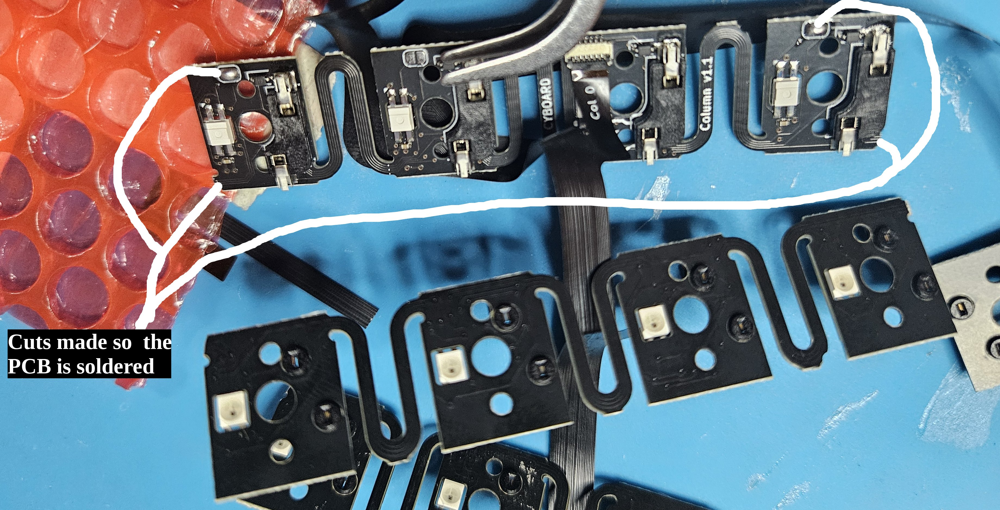
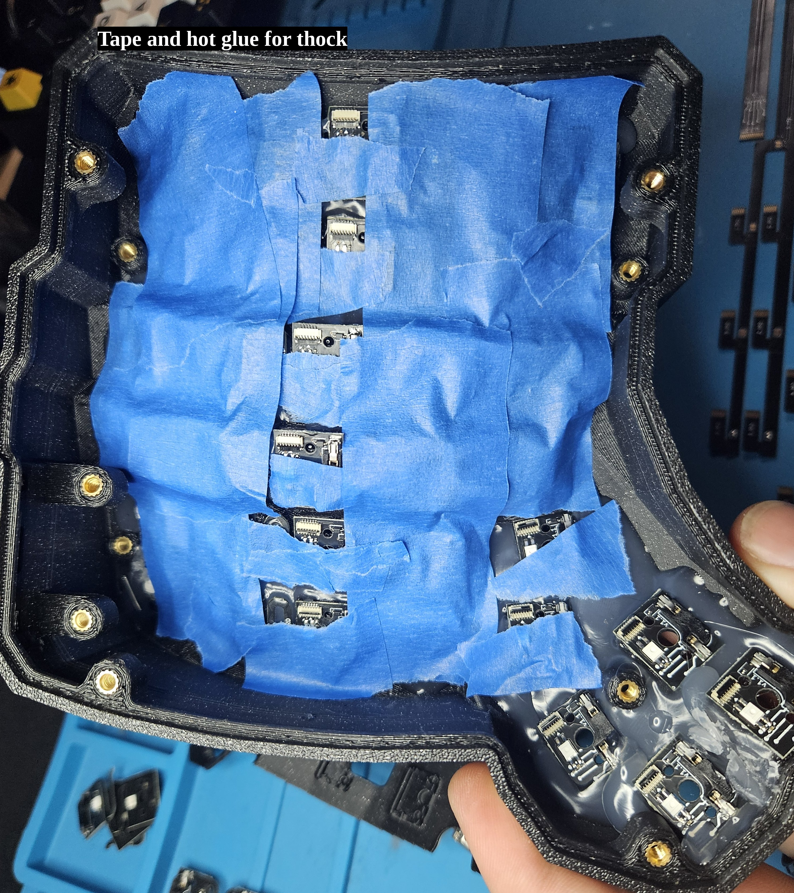

# Cyboard Keyboard Assembly Guide

- This is a loose guide hitting the major points of assembling the cyboard keyboard. This should get you started.
- Check [Cyboard](https://www.cyboard.digital) for official keyboards and merch.
- Check the [Discord](https://discord.com/invite/4hf8uEnrfj) for further support.
- no affiliation, just a guy who built a keyboard from cyboard, and i felt like making a loose simple guide, so one might have an idea of what is involved in building one.

## Materials Needed

- Keyboard case
- Backplate
- Bottom plate
- Cherry MX switches
- USB cable (Type-C to computer)
- PCB (Printed Circuit Board)
- Ribbon cables
- Soldering iron and solder
- Hot glue (optional, for thock, making it sound deeper & quieter)
- Paperclip or pointed tweezers (for testing hot swap sockets)

## Tools Needed

- Rounded tweezers
- Pointed tweezers (or paperclip)
- Screwdriver (T10)
- Masking tape (recommended)
- Cutters
- Hot glue gun (optional)

## Step 1: Cutting PCB and Ribbon Cables

### Instructions

1. **Cut the PCB to Size:**

   - Ensure the ribbon cable connector remains on the home row, identified by the backplate holes for the ribbon.
   - For a 5x6 layout, cut the top section off and solder the top jumpers.
   - For the two shorter columns, cut off a bottom section and solder the jumpers there as well.
   - Anytime you make a cut to the PCB, locate the closest jumper and solder the pad. This is crucial for LEDs. (its the data connection)

2. **Cut the Ribbon Cables:**
   - Cut the ribbon at the cut lines indicated on the cable, to desired length.
   - For the Manuform or 6 thumb switches, you'll cut 1 off each thumb section. This means you'll use 7, 6, & 5, and 3, 2, & 1, cutting off 4 and 0. This will all depend on the keyboard you are building.
   - Solder the closest jumper to the cut on the ribbon cable, just like the PCB.

## Step 2: Testing components before assembly

### Instructions

1. **Connect Everything:**

   - Wire the components together outside of the keyboard.
   - Connect either the left or right assimulator to the ribbon.
   - Once the assimulator, PCBs, and ribbon are all connected, and the USB is connected to the computer, the keyboard should function. All LEDs should be on, and all switches should work. Connecting the two hotswap pins on the PCB should simulate a button press.

2. **Troubleshooting:**
   - If all LEDs and hot sockets do not work, check section 2b.
   - If nothing works & the board does not enter bootloader mode (show up as a USB storage device on your computer), check section 2c.
   - If LEDs do not work, or partially work, but the switches seem to work, check section 2d.

### Step 2b: Flashing the Board

1. **Use the Default UF2 File:**
   - Connect the board to your computer and double-tap the reset button.
   - The computer should recognize the board as a usb storage device.
   - Copy the UF2 file to the flash drive.

### Step 2c: Manual Bootloader Mode

1. **If Double-Tap Reset Doesn't Work:**
   - Bridge the boot holes on the backside of the board.
   - Tap the reset button to enter bootloader mode.
   - Copy the UF2 file to the usb storage device (assimulator).

### Step 2d: Some LEDs Don't Work

1. **Verify Jumper Pads:**
   - Ensure you soldered your jumper pads correctly.
   - Check that jumper pads that do not require solder are not shorted out or bent, touching each other.
   - For further troubleshooting, see the Discord community.

## Step 3: Installing PCB into the Case

### Instructions

1. **Line Up and Insert:**

   - Insert a switch into the top and bottom slots of the keyboard case, then pop the PCB onto them.
   - The middle section isn't necessarily needed as the backplate should hold the PCB in place. If you intend to glue and tape the PCB for more thock, it's recommended to put a switch into every slot to hold the PCB in place while you glue and tape.
   - There are a few spots that you have to put the board in prior to the switch, as the screw post for the backplate is right next to the pcb, or the pcb slides into a groove on the thumb cluster. Simply place the PCB in these spots first than put the switch in to hold it into place.

2. **Hot Gluing Tips:**
   - Avoid hot gluing the ribbon cable sockets, I would keep them all closed to prevent strings accidentally going into your sockets and ruining your boards.
   - Note that hot glue can make PLA printed cases slightly mushy until it cools down. Avoid pushing them out of place, its so slight you might not notice.
   - To quickly dry the glue and prevent the case from deforming, place it in the freezer after hot gluing (optional, but 30-60 seconds will speed up the process).
   - Putting hot glue in between the rows and columns can help with sound and holding the PCB in place. The backplate holds the PCB, so this step is optional and mainly for enthusiasts who want that extra thock.
   - You can also add painter's tape or electrical tape for maximum thockage.

## Step 4: Connecting the Ribbon Cable

### Instructions

1. **Insert Ribbon Cable:**

   - Start with column 0 and insert the ribbon with copper pins down.
   - Use masking tape to hold extra strands out of the way.
   - Use rounded tweezers to carefully insert the ribbon into its socket.
   - Snap the black plastic latch into place. See image, a good technique is to use the tweezers to insert the cable, than using the backside of the tweezers to hold the cable in place and the front side to close the latch.

2. **Column Reference:**
   - Below is a picture of the columns labeled on the ribbon, indicating where each one goes. It really only fits one way.
   - The thumb cluster should start with columns 3 and 7. If the cable is connected out of order, it can be corrected in the firmware easily.

**Note:**

- Cover the jumper pads with tape or glue, especially if you add tape or foam to the inside of the case, as this can cause the ribbon to bend. If you accidentally connect those jumpers, your LEDs can stop working.
- To prevent hard creases in the ribbon cable, place the bend of the cable down into the holes of the backplate where the PCB and sockets are, then tape over it. This way, you don't have a hard crease, and you have a flat surface on your backplate, allowing for more foam and tape for sound dampening.

## Step 5: Final Assembly and Programming

### Instructions

1. **Screw Everything Together:**

   - Secure the backplate and drop in your PCB controllers.

2. **Programming the Controllers:**

   - Each controller board needs to be programmed separately.
   - Ensure you can program them before securing them in place.
   - Use either Via or QMK for RP2040, or ZMK for Nice!Nanos.
   - If you are happy with the default layout, and everything worked from step 2, you can just skip this part.

3. **Using Programming Tools:**
   - Copy the files to the board as if it’s a flash drive.
   - Vial QMK is a option as well [Vial-QMK-Github](https://github.com/Cyboard-DigitalTailor/vial-qmk)
   - Alternatively you can use the QMK CLI tool for flashing. Refer to the QMK documentation. [QMK RP2040 documentation](https://github.com/qmk/qmk_firmware/blob/master/docs/platformdev_rp2040.md)
   - For ZMK, follow the ZMK documentation for programming Nice!Nanos. [Cyboard ZMK github](https://github.com/Cyboard-DigitalTailor/zmk-user-config-template)

